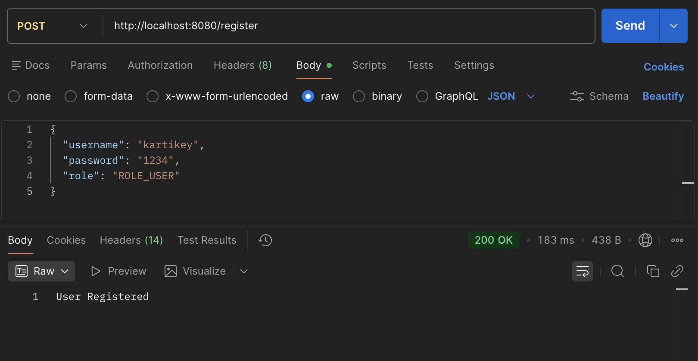

# 🔐 Full Stack Experiment 7 - JWT Authentication & RBAC

## 📌 Project Overview

This project is a **Spring Boot RESTful API** implementing **secure authentication and authorization** using:

* JWT (JSON Web Token)
* Spring Security
* Role-Based Access Control (RBAC)

It includes:

* Secure login system with JWT token generation
* Token validation using custom filter
* Role-based authorization (USER / ADMIN)
* Stateless authentication (no sessions)
* H2 In-Memory Database

---

## 🛠️ Tech Stack

* Java 17
* Spring Boot
* Spring Security
* Spring Data JPA
* JWT (io.jsonwebtoken)
* H2 Database
* Maven
* Postman

---

## 📂 Project Structure

```
jwt-security-app/
 ├── controller/
 ├── service/
 ├── repository/
 ├── entity/
 ├── security/
 ├── config/
 ├── util/
 └── JwtSecurityApplication.java
```

---

## ⚙️ How to Run the Project

### 1️⃣ Clone Repository

```bash
git clone https://github.com/KartikeyDubey01/Full-Stack-Experiment-7.git
cd Full-Stack-Experiment-7
```

### 2️⃣ Run Application

```bash
./mvnw spring-boot:run
```

---

## 📬 API Endpoints

| Method | Endpoint   | Description           | Access |
| ------ | ---------- | --------------------- | ------ |
| POST   | /register  | Register new user     | Public |
| POST   | /login     | Login & get JWT token | Public |
| GET    | /api/user  | User dashboard        | USER   |
| GET    | /api/admin | Admin dashboard       | ADMIN  |

---

## 🧪 Sample Requests

### 🔹 Register User

```json
POST /register

{
  "username": "kartikey",
  "password": "1234",
  "role": "ROLE_USER"
}
```

### ✅ Response

```
User Registered
```

---

### 🔹 Login User

```json
POST /login

{
  "username": "kartikey",
  "password": "1234"
}
```

### ✅ Response

```json
{
  "token": "eyJhbGciOiJIUzI1NiJ9..."
}
```

---

## 🔐 Authorization Header

```text
Authorization: Bearer <JWT_TOKEN>
```

---

## 🔒 Role-Based Access Control

| Endpoint   | USER | ADMIN |
| ---------- | ---- | ----- |
| /api/user  | ✅    | ✅     |
| /api/admin | ❌    | ✅     |

---

## 🔄 Application Flow

1. User registers via `/register`
2. User logs in via `/login`
3. JWT token is generated
4. Client sends token in request header
5. JWT Filter validates token
6. Spring Security checks roles
7. Access granted or denied

---

## 🗄️ H2 Database Access

URL:

```
http://localhost:8080/h2-console
```

JDBC URL:

```
jdbc:h2:mem:testdb
```

---

## 📸 Screenshots

### 🔹 Register API (Postman)



---

## ✅ Features Implemented

✔ JWT Authentication
✔ Stateless Security
✔ Role-Based Access Control (RBAC)
✔ Secure API Endpoints
✔ Password Encryption (BCrypt)
✔ H2 Database Integration

---

## 👨‍💻 Author

**Kartikey Dubey**
UID: 23BCT10003

---

## 🎯 Conclusion

This project demonstrates secure authentication using **Spring Security with JWT** and implements **role-based authorization**. It ensures scalable, stateless, and secure API communication.

---
